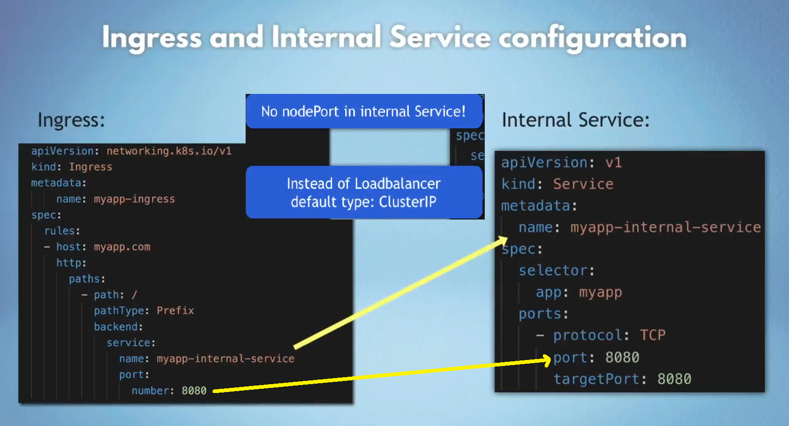
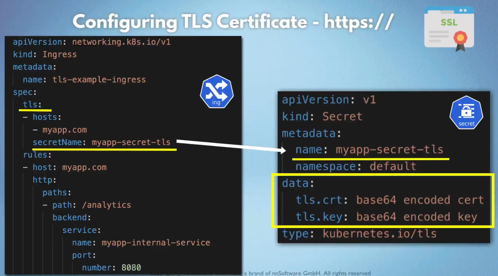
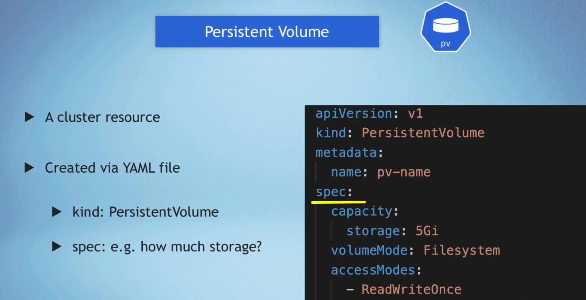
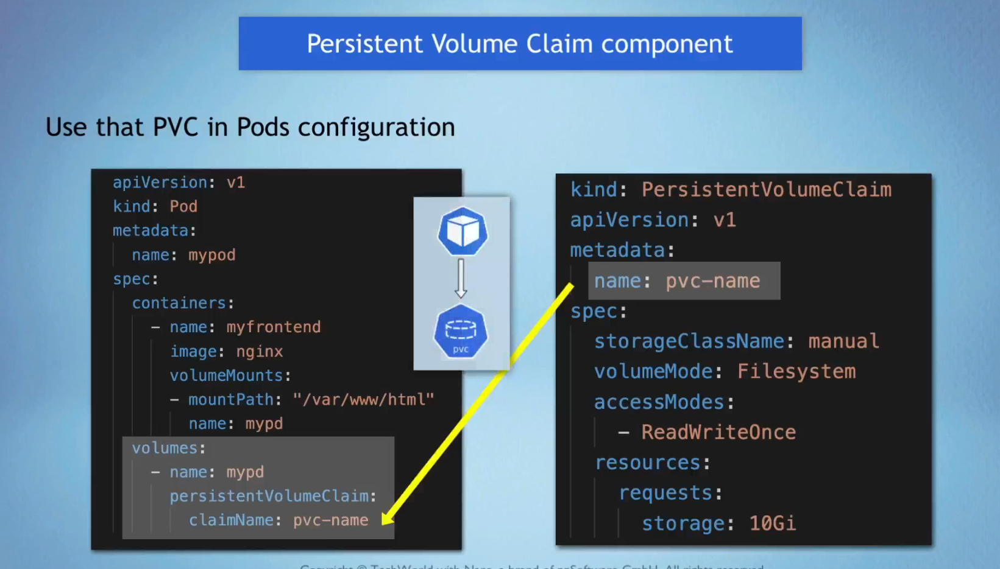

# ☸️ Kubernetes

My sandbox for mastering Kubernetes

## Basic Commands

```bash
kubectl get nodes
```

```bash
kubectl get services
```

```bash
kubectl get pods
```

## 🔹 Main kubectl Commands

### 📝CRUD Commands

**Create deployment**

```bash
kubectl create deployment nginx-depl --image=nginx
```

```bash
kubectl create deployment mongodb-deployment --image=mongo
```

**Edit deployment**

```bash
kubectl edit deployment nginx-depl
```

**Delete deployment**

```bash
kubectl delete deployment mongodb-deployment
```
```bash
kubectl delete -f [name].yaml
```

### 📊 Status of Different K8s Components

```bash
kubectl get nodes|pod|services|replicaset|deployment|secret
```

```bash
kubectl get pod -o wide
```

### 🐛 Debugging Tools

**Logs**

```bash
kubectl logs nginx-depl-5fcbf6fffd-w6r6n
```

**Get interactive terminal**

```bash
kubectl exec -it mongodb-deployment-7f79558879-slcch -- bash
```

**Get info about pod**

```bash
kubectl describe pod mongodb-deployment-7f79558879-slcch
```

### ⚙️ Use Configuration File for CRUD

**Apply configuration**

```bash
kubectl apply -f nginx-deployment.yaml
```

**Delete using configuration**

```bash
kubectl delete -f nginx-deployment.yaml
```

### 🌐 Assign external IP address for LoadBalancer
```bash
minikube service mongo-express-service --url
```

---
## Notes:
### **Create secret, configmap first than apply them. After that our depl can see them.**
### **After changing configmap, secret we need  to:**
```bash
kubectl rollout restart deployment
```

### **Secrets are stored like base64**
---
```bash
echo -n 'username' | base64
```


## Ingress

```bash
minikube addons enable ingress
```


```bash
minikube dashboard
```

```bash
kubectl get ns
```

```bash
kubectl get all -n kubernetes-dashboard
```

```bash
kubectl apply -f dashboard-ingress.yaml
```

```bash
kubectl get ingress -n kubernetes-dashboard
```

```bash
minikube tunnel
```

Secret component must be in the **same namespace** as the ingress component
### configuring tls certificate


## Volume
Volume is directory with some data
1. Storage must not depend on the pod lifecycle
2. Storage mush be available on all nodes
### Persistent Volume


pod requests the volume through the PV claim.
Claim tries to find a volume in cluster.
volumeMounts - volume is mounted into container
Volume is mounted into the Pod.
### Pod using Perstistent Volume Claim conf
